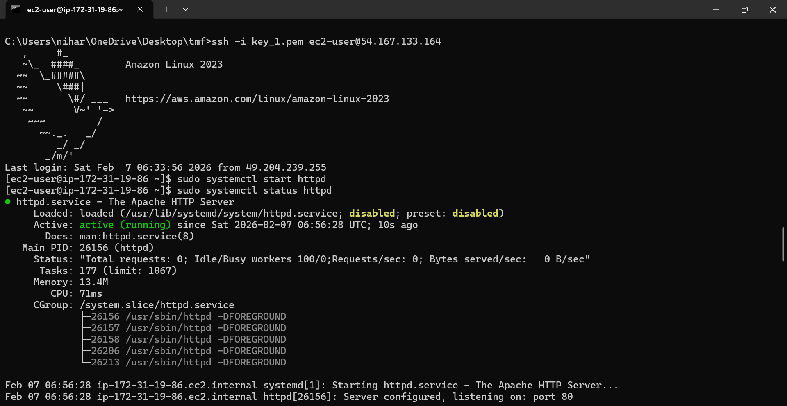
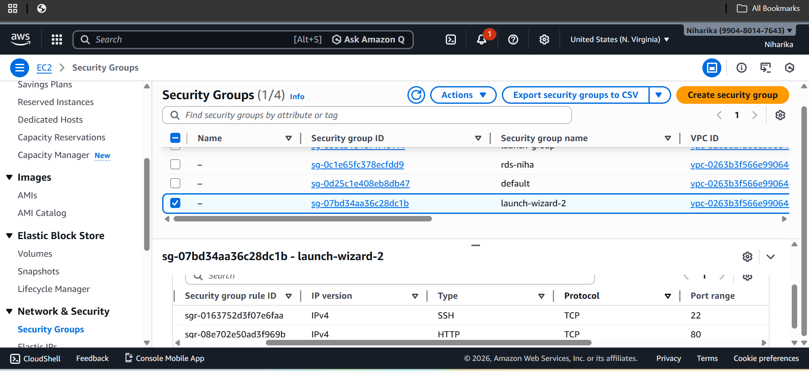

# AWS Secure Web App Deployment

## Overview
Deployed a public web server on AWS EC2 using Apache and Linux. Configured security groups, SSH, and hosted a static web page.

## Files
- index.html – simple HTML page hosted
- screenshots/ – proof of deployment steps

## Steps
1. Launched EC2 instance
2. Installed Apache
3. Opened port 80 (HTTP)
4. Hosted website
5. Took screenshots and uploaded here

## Screenshots
Below are key steps of deployment:

## Author
**Niharika Gali**
